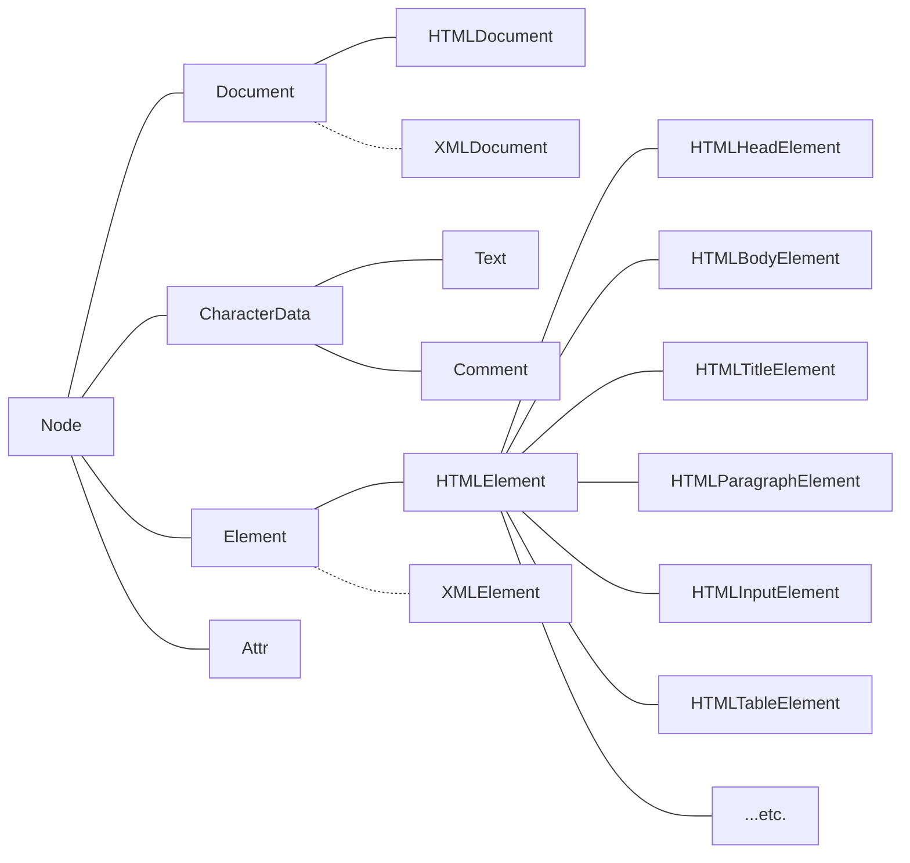

# 错误
会引发后续代码中止但不会影响其他代码块

## 错误类型
 - **低级错误**（语法解析错误）
    解释器执行代码前会先进行代码扫描查找低级错误。如果发现低级错误，则不会执行任何一行代码

 - **逻辑错误**（标准错误）
    会在错误发生行触发报错，后续代码不会执行但不影响已执行的部分

***

# 类型转换
## 显式类型转换

1. `Number()`
将参数转化为数字并返回。如：
   ```javascript
   Number("123"); // 123
   Number("-1"); // -1
   Number("123abc"); // NaN
   Number(true); // 1
   Number(null); // 0
   Number(undefined); // NaN
   Number("a"); // NaN
   ```

2. `parseInt()`
将参数转化为**整数**并返回。从数字位开始往后看，看到非数字位截至。
   - 参数1：需要转化为整数的内容
   - 参数2：基底/进制。取值 2~36，默认为 10
   ```javascript
   parseInt("123"); // 123
   parseInt(true); // NaN
   parseInt(false); // NaN
   parseInt(null); // NaN
   parseInt(undefined); // NaN
   parseInt(123.9); // 123
   parseInt("123.9"); // 123
   parseInt("123abc"); // 123
   parseInt("abc123abc"); // NaN
   parseInt("10", 16); // 16
   parseInt("20", 2); // NaN
   ```

3. `parseFloat()`
将参数转化为**浮点数**。从数字位开始看，看到除了第一个 `.` 以外的非数字位截至。

4. `String()`
将参数转化为**字符串**。
   ```javascript
   String(123); // "123"
   String(true); // "true"
   String(undefined); // "undefined"
   ```

5. `Boolean()`
将参数转化为**布尔类型**。
   - 对于 `false`, `0`, `null`, `undefined`, `""`, `NaN` 返回 `false`
   - 对于其他情况返回 `true`

6. `toString()`
将成员转为**字符串**。`undefined`与`null` 没有该属性。
   - 参数1：基底/进制。取值 2~36，默认为 10
   ```javascript
   "123".toString(); // "123"
   (123).toString(); // "123"
   (123).toString(16); // "7b"
   ```

## 隐式类型转换
1. `isNaN()`
首先将参数使用 `Number(param)` 转换，再判断其是否是 `NaN`
   ```javascript
   isNaN(NaN); // true
   isNaN(123); // false
   isNaN("1"); // false
   isNaN("a"); // true
   isNaN(null); // false
   isNaN(undefined); // true
   ```

2. `++`, `--`, `+`(一元正), `-`(一元负)
首先调用 `Number()` 转换。

3. `+`(加号)
两侧有任何一侧是字符串，就会调用 `String()` 转换。

4. `-`, `/`, `*`, `%`
首先调用 `Number()`

5. `&&`, `||`, `!`
调用 `Boolean()`

6. `>`, `<`, `<=`, `>=`
有一方为数字则调用 `Number()`
   - 特殊的，`undefined` 和 `null` 不能与 `0` 比较(即既不大于0，也不小于0，也不等于0)

7. `==`, `!=`
对于 `==`，如果：
   - 类型相同时
      - 如果是基本数据类型，比较值
      - 如果是对象类型，比较地址
   - 一个是`null`，一个是`undefined` --> `true`
   - 一个是数字，一个是字符串 --> 将 字符串 转换为数字
   - 一个是布尔值 --> 将 x 转换为 数字
   - 一个是字符串或数字，另一个是对象 --> 将 y 先使用 `valueOf()`，如果不是原始值，再调用 `toString()`
   - `NaN == NaN` --> false
   - 特殊的，`undefined` 和 `null` 不能与 `0` 比较(即既不大于0，也不小于0，也不等于0)

对于 `!=` ，结果与 `==` 相反，转换规则完全相同

***

# 预编译

## imply global
1. **暗示全局变量**。任何变量，如果未经声明就赋值，此对象就为全局对象(`window`)所有。

如：
```javascript
console.log(a); // 报错
```

```javascript
a = 10;  // window.a = 10
console.log(a); // 10
```

2. 全局上的任何变量，即使声明了，也归 `window` 所有。
一切声明的全局变量，都是 `window` 的属性

> `window` 就是全局的**域**

## 预编译
预编译发生在函数执行的前一刻。

1. 创建 AO (Activation Object) 对象 （ ≈ 作用域，执行期上下文）
   > 对于全局预编译，将会生成 GO (Global Object) 对象 ( ≈ 全局作用域，全局执行期上下文)，即 `window`
2. 找形参和变量声明(var型)，将变量和形参名作为 OA 属性值，值为 `undefined`
3. 将实参和形参统一
   > 对于全局预编译，没有该步骤
4. 找函数声明(`function xxx() {}`)，名作为 OA 属性名，值赋予函数体

如：
   ```javascript
   function fn(a) {
      console.log(a);         // function a() {}
      var a = 123;            // 变量声明提升已完成，但赋值未执行，所以 :>> AO.a = 123;
      console.log(a);         // 123
      function a() {}         // 预编译时已提升，跳过
      console.log(a);         // 123
      var b = function() {}   // b 的声明已提升，执行赋值 :>> AO.b = function() {}
      console.log(b);         // function() {}
      function d() {}         // 预编译已提升，跳过
   }
   fn(1);
   ```

   - 经过步骤 1，创建执行期上下文如下：
   ```javascript
   AO = {
   }
   ```
   
   - 经过步骤 2，执行期上下文为
   ```javascript
   AO = {
      a : undefined,
      b : undefined
   }
   ```

   - 经过步骤 3，将形参赋值：
   ```javascript
   AO = {
      a : 1,
      b : undefined
   }
   ```

   - 经过步骤 4，将函数声明（注意 b 为函数表达式而非函数声明）
   ```javascript
   AO = {
      a : function a() {},
      b : undefined,
      d : function d() {}
   }
   ```

***

# 作用域精解

## `[[scope]]`
存储由当前函数产生而产生的作用域。
*隐式属性*，外界无法直接读取和使用。

**作用域链**： `[[scope]]`中存储的执行期上下文的集合

## 立即执行函数

形式：
```javascript
(function() {
   // code block
}())

(function() {
   // code block
})()
```

> 只有表达式才能被执行符号执行

***

# 对象

## 对象创建方法
1. `var obj = {}`：plainObject，对象字面量/对象直接量
2. 构造函数创建方法：
   - **系统自带的构造函数**：`Object()`: 
      ```javascript
      var obj = new Object();
      ```
   - **自定义**
      ```javascript
      function Obj () {}
      var obj = new Obj();
      ```

## 原型/原型链

### call/apply
作用：改变`this`指向

- call
   参数1用于改变this指向，其他参数作为正常调用时的实参。
   函数中，将所有预设的`this`指向传入的第一个参数（默认时`this`指向`window`）

- apply
   与`call`几乎没区别，唯一的区别是传参列表不同。
   apply 第一个参数 为目标`this`指向，第二个参数为一个**数组**，表示实参列表

### instanceof
```javascript
a instanceof B
```

判断 a 对象是否是由 B 构造函数构造出来的

> 看 a 对象的原型链上有没有 B 的原型

## this
1. 函数预编译过程中，`this` 指向 `window`
2. 全局作用域中，`this` 指向 `window`
3. `call` 和 `apply` 会改变 `this` 指向
4. `obj.func()`，func中的 `this` 指向 调用者`obj`

eg:
   ```javascript
   var name = "222";
   var a = {
      name: "111",
      say: function () {
         console.log(this.name);
      }
   }
   var fun = a.say;
   fun();
   a.say();
   var b = {
      name: "333",
      say: function (fun) {
         fun();
      }
   }
   b.say(a.say);
   b.say = a.say;
   b.say();
   ```

   **解析：**
   ```javascript
   var fun = a.say;
   fun();
   ```
   > `a.say` 是函数引用，保存至 `fun` 中并调用，即为**在全局内执行**，此时`this`指向`window`。输出 `222`

   ***

   ```javascript
   a.say();
   ```
   > `a` 调用 `say` 执行，此时`this`指向`a`，输出 `111`

   ***

   ```javascript
   b.say(a.say);
   ```
   > `b` 调用 `say`，`this`指向`b`，同时传入参数 `a.say` 的引用作为参数`fun`，此时调用 `fun()`，并无调用者（如`b.fun()`），此时`fun`内部的 `this` 指向 `window` ，输出 `222`

   ***

   ```javascript
   b.say = a.say;
   b.say();
   ```
   > 将 `a.say` 的引用赋值给 `b.say` ，此时调用 `b.say()` ，方法中的 `this` 指向 `b` ，输出 `333`

# 数组

## 方法：
|方法|作用|参数|返回值|版本|
|:--:|:--:|:-:|:----:|:-:|
|`push`|向当前数组末尾添加元素|<ol style="text-align: start;"><li>`...items`: 被添加的元素</li></ol>|操作完成后的数组长度|ES3.0|
|`pop`|弹出当前数组末尾的元素|---|被弹出的数组元素|ES3.0|
|`shift`|弹出当前数组第一个元素|---|被弹出的数组元素|ES3.0|
|`unshift`|向当前数组开头添加元素|<ol style="text-align: start;"><li>`...items`: 被添加的元素</li></ol>|操作完成后的数组长度|ES3.0|
|`reverse`|将当前数组逆向(直接对原数组操作)|---|逆转后的当前数组|ES3.0|
|`splice`|将当前数组进行截取(**切片**)，删除被截取的内容并返回|<ol><li>`start`: 从第几位开始</li><li>`?deleteCount`: 截取多少的长度</li><li>`?...items`: 在切口处添加新的数据</li></ol>|被截取的内容|ES3.0|
|`sort`|在原数组基础上进行排序。默认（不传参时）为升序排序。将所有数据转为字符串(调用 `toString`)后比对 ASCII码 |<ol style="text-align: start;"><li>`?compareFn`: 对比两个数据的函数。<ul><li>需要接受两个形参</li><li>看函数返回值：当返回值为负数时，前面的值放在前面；当返回值为正数时，后面的值放在前面；为0时不动</li></ul></li></ol>| |ES3.0|
|`concat`|将参数中传入的数组拼到当前数组中并返回结果。**不会改变原数组**|被拼接的数组|两个数组拼接后形成的新数组|ES3.0|
|`toString`|将数组转为字符串||转为字符串后的结果。如 ```[1,2,3].toString(); // '1,2,3'```|ES3.0|
|`slice`|从当前数组中截取一段。**不影响原数组**|<ol style="text-align: start;"><li>`?start`: 从下标几开始截取。不提供该参数即从0开始</li><li>`?end`: 截取到下标几(不包含该下标)。不提供该参数即截取到末尾</li></ol>|被截取出来的数组|ES3.0|
|`join`|将数组中每一位连接起来，使用参数进行分隔|<ol style="text-align: start;"><li>`separator`: 两个元素中间间隔的字符串</li></ol>|拼接后形成的字符串|ES3.0|

***

# try-catch

## `Error.name`
1. `EvalError`: eval()的使用与定义不一致
2. `RangeError`: 数组越界
3. `ReferenceError`: 非法或不能识别的引用数值
4. `SyntaxError`: 发生语法解析错误
5. `TypeError`: 操作数类型错误
6. `URIError`: URI处理函数使用不当

## 严格模式
目前的浏览器都是基于 ES3.0 + ES5.0的新增方法 使用的
对于 ES3.0 与 ES5.0 冲突的部分：
 - 如果是用**严格模式**，使用 ES5.0 的标准
 - 否则使用 ES3.0 的标准

启用严格模式的方法，是在代码顶端加上如下代码：
```javascript
"use strict";
```

### 具体差异
 - 不允许使用 `arguments.callee` 和 `function.caller`
 - 不允许使用 `with`
   **with**
      ```javascript
      with (obj) {
         // code
      }
      ```
      > `with`: 将obj作为with代码体的作用域链的最顶端
 - 局部的`this`必须被赋值，而且赋值什么就是什么。如：
      ```javascript
      "use strict";
      function test() {
         console.log(this);
      }
      test(); // 输出--> undefined ，不再指向 window
      new test(); // 输出--> test {}
      ```

      ```javascript
      "use strict";
      function test() {
         console.log(typeof this);
      }
      test.call(123); // 输出--> number ，即 this 为 123 本身而不是ES3.0中的 Number(123)
      ```
 - 拒绝重复属性和参数
      ```javascript
      function test(a, a) {
         console.log(a);
      }
      test(1, 2);
      // 在非严格模式下，输出--> 2
      // 在严格模式下：报错
      var obj = {
         a: 1,
         a: 2
      };
      // 在ES5.0中并不报错(截至 2025 年)。后面的会覆盖前面的
      ```
 - `eval`作用域不同

 ***

# DOM
 Document Object Model，文档对象模型。
 DOM定义了一系列操作html和xml的一类对象的集合。
 由浏览器厂商决定。
 
## 选择器

- `document.getElementById`
   传入id值的字符串。获取id为该字符串的**一个**元素。
   如：
   ```javascript
   document.getElementById("only");
   ```
   在 ie8 及以下的浏览器中，id不区分大小写；并且如果没有该id的元素，则 `name` 为该id的元素也会被选中

- `document.getElementsByTagName`
   通过标签名选中所有元素，返回一个集合（类数组）
   无兼容性问题，*主流方法*

- `document.getElementsByClassName`
   通过`class`选中所有包含该class的所有元素。返回一个集合（类数组）
   ie8及以下版本**没有**该方法

- `document.getElementsByName`
   选中所有`name`属性为该name的元素。返回一个集合（类数组）
   在早版本浏览器中，只有**部分**标签的name属性可以生效，如表单、表单元素、img、iframe等

- `document.querySelector`
   按照css的筛选规则选中一个元素
   ```javascript
   document.querySelector("div > span .strong")
   ```

- `document.querySelectorAll`
   按照css规则选中所有匹配的元素
   **缺陷**：
      1. ie7及以下没有这些方法
      2. 选中的元素并不是实时的

## 遍历节点树
一切DOM元素都具备这些属性。
 - `parentNode`
   获取当前节点的父节点。
   
 - `childNodes`
   获取当前节点的所有子节点。包括文本节点。

 - `firstChild`
   获取当前节点第一个子节点。

 - `lastChild`
   获取当前节点最后一个子节点。

 - `nextSibling`
   获取当前节点的后一个兄弟节点。

 - `previousSibling`
   获取当前节点前一个兄弟节点。

## 遍历**元素**节点数
 - `parentElement`
   获取当前元素的元素父节点。（`document`不是元素）。*ie9及以下不兼容*

 - `children`
   获取当前元素的元素子节点

 - `childElementCount`
   完全等于 `children.length` ，获取当前元素子节点的个数。*ie9及以下不兼容*

 - `firstElementChild`
   获取当前元素的第一个元素子节点。*ie9及以下不兼容*

 - `lastElementChild`
   获取当前元素的最后一个元素子节点。*ie9及以下不兼容*

 - `nextElementSibling`
   获取当前元素的后一个兄弟元素节点。*ie9及以下不兼容*

 - `previousElementSibling`
   获取当前元素的前一个兄弟元素节点。*ie9及以下不兼容*

## 节点的类型

|节点类型|属性值|
|:-----:|:----:|
|元素节点|1|
|属性节点|2|
|文本节点|3|
|注释节点|8|
|document|9|
|DocumentFragment|11|

## 节点的属性
 - `nodeName` 获取当前节点的标签名。以大写形式表示，只读。
 - `nodeValue` 获取 Text 和 Comment 节点的文本内容。可读写。
 - **`nodeType` 获取当前节点的类型**。只读。返回对应节点的属性值
 - `attribute` 获取当前节点的属性节点的集合。

 - `Node.hasChildNodes()` 返回当前节点是否存在属性节点。

# DOM结构树


1. `getElementById`方法定义在了`Document.prototype`上
2. `getElementsByName`方法定义在了`HTMLDocument.prototype`上
3. `getElementsByTagName`定义在了`Document.prototype`和`Element.prototype`上
4. `HTMLDocument.prototype`上定义了一些常用的属性，`body`指代文档的`<body>`元素，`head`指代文档的`<head>`元素
5. `Document.prototype`上定义了`documentElement`属性，代表文档的`<html>`元素
6. `getElementByClassName`, `querySelectorAll`, `querySelector` 在`Document.prototype`和`Element.prototype`中均有定义

# DOM基本操作

## 增
 - `document.createElement()` 创建一个元素节点
 - `document.createTextNode()` 创建一个文本节点
 - `document.createComment()` 创建一个注释节点
 - `document.createDocumentFragment()`

## 插
 - `appendChild(childNode)` 任何一个元素节点都有该方法，向当前元素的末尾添加子节点。如果将页面中已存在的节点插入到其他节点中，操作为 移动（剪切），原位置的节点移动到新的位置。
 - `insertBefore(a, b)` insert a before b，在 b 节点之前插入 a 节点

## 删
 - `parentNode.removeChild(target)` 父节点移除指定的子节点，**返回**被移除的节点
 - `node.remove()` 移除当前节点。**销毁**该节点。（from ES5.0）

## 替换
 - `parentNode.replaceChild(new, ori)` 用 新元素 替换 老元素。**返回**被替换的元素

## Element的一些属性和方法
 - `innerHTML` 获取/改变内部的html内容
 - `innerText` 获取/写入元素内的文本内容。忽略所有标签但返回内层标签内的文本同年。赋值时覆盖所有内容。（火狐不兼容）
 - `textContent` 同 innerText，（老版本IE不好使）

 - `setAttribute(name, value)` 向当前元素设置一个行间属性。name为属性名，value为属性值
 - `getAttribute(name)` 从当前元素获取名为 name 的行间属性

# 日期对象 Date

W3C[参考文档](https://www.w3school.com.cn/jsref/jsref_obj_date.asp)

***

# DOM基本操作

1. 查看滚动条的滚动距离

   - `window.pageXOffset/pageYOffset`
      > IE8及以下不兼容
   - `document.body/documentElement.scrollLeft/scrollTop`
      > IE8及以下支持。支持较混乱，用时通常取两个值相加，如 `document.body.scrollLeft + document.documentElement.scrollLeft`。特点：其中一个有值，另一个的值一定是`0`

2. 查看可视区窗口的尺寸

   - `window.innerWidth/innerHeight`
      > IE8及以下不兼容
   - `document.documentElement.clientWidth/clientHeight`
      > 标准模式下，任意浏览器都兼容
   - `document.body.clientWidth/clientHeight`
      > 适用于怪异模式下的浏览器

3. 查看元素的几何尺寸

   - dom元素.`getBoundingClientRect()`
      > ES5的新方法
      > 兼容性良好
      > 返回元素的属性，包括 left/top/right/bottom/width/height
      > height/width 在老版本IE中未实现
      > 返回的结果并不是实时的，是此时状态的快照
   
   - `dom.offsetWidth/offsetHeight`
   
4. 查看元素的位置

   - `dom.offsetLeft/offsetTop`
      > 对于无定位父级的元素，返回相对于文档的坐标
      > 对于有定位父级的元素，返回相对于最近的有定位父级的坐标

5. 获取最近有定位的父级

   - `dom.offsetParent`
      > 获取最近的有定位的父级。如无，返回 null

6. 让滚动条滚动

   - `window.scroll()/scrollTo()`
      > 滚动条滚动到**特定位置**
      > 参数1：滚动条滚动目标位置的x坐标
      > 参数2：滚动条滚动目标位置的y坐标

   - `window.scrollBy()`
      > 滚动条滚动**特定距离**
      > 参数1：滚动条滚动的x坐标距离
      > 参数2：滚动条滚动的y坐标距离

***

# 脚本化CSS

1. 读写元素CSS属性

   - `dom.style.prop`
      > 可读可写行间样式，没有兼容性问题。
      > 遇到保留字属性，前面应加**css**。如 `float --> cssFloat`
      > 复合属性必须拆解
      > 组合单词变为**小驼峰**写法
      > 写入的值必须是**字符串**属性

2. 查询计算样式

   - `window.getComputedStyle(elt, pseudoElt)`
    
      | 参数 | 类型 | 说明 |
      |-----|-------|-----|
      |`elt`| Dom | 需要查询的元素 |
      |`pseudoElt`| String | 如果需要查询伪元素的属性，传入伪元素名称 |

      > 获取当前元素的所有CSS显示值
      > 计算样式只读
      > 返回的计算样式的值都是绝对值，没有相对单位
      > IE8及以下不兼容

   - `dom.currentStyle`
      > 计算样式只读
      > 返回的计算样式的值不是经过转换的绝对值
      > IE独有属性

***

# 事件

## 绑定事件

1. `dom.onxxx`

句柄的绑定方式

> 兼容性很好，但是每个元素的每个事件只能绑定一个函数
> 等同于写在html行间上
> `this`指向DOM元素自身

```html
<script>
   div.onclick = function () {
      doSomething();
   }
</script>

<!-- 等同于 -->

<div onclick="doSomething()"></div>
```

2. `obj.addEventListener(type, fn, false)`

> 同一个函数绑定多次也只会执行一次
> `this`指向DOM元素自身
> IE8及以下不兼容

```javascript
div.addEventListener("click", function () {
   doSomething();
}, false)
```

3. `dom.attachEvet(type, fn)`

   - `type`: `"on"` + 事件类型
   - `fn`: 处理函数

> 同一个函数绑定多次能够执行多次
> `this`指向`window`
> IE独占

```javascript
div.attachEvent("onclick", function () {
   doSomething()
})
```

## 解除绑定事件

1. `dom.onclick` 的方式

```javascript
dom.onclick = null
```

2. `dom.removeEventListener(type, fn, false)`

> 解除特定事件的指定的绑定函数
> 匿名函数无法解除绑定

3. `dom.detachEvent(type, fn)`

***

## 事件处理模型

一个对象的一个事件类型只能存在一个事件模型

### 冒泡

**结构上**嵌套关系的元素会存在事件冒泡，子元素的事件会冒泡到父元素（自底向上）

### 捕获

`addEventListener`参数3修改为 `true`即可触发

**结构上**嵌套关系的元素，父元素的事件会被子元素（事件源元素）捕获（自顶向下）

> IE不支持捕获
> 执行顺序：先捕获后冒泡
> focus, blur, change, submit, reset, select 等事件不冒泡

### 阻止冒泡

1. `event.stopPropagation()`

事件处理函数中传递一个参数，该参数记录了触发事件时的关键状态信息。在该对象中存在这个函数，可以阻止冒泡行为。

```javascript
div.addEventListener("click", function (event) {
   event.stopPropagation()
}, false);
```

> IE8及以下不兼容

2. `event.cancelBubble = true`

```javascript
div.attachEvent("onclick", function (event) {
   event.cancelBubble = true
})
```

> IE独有

### 阻止默认事件

1. `return false`

> 以对象属性的方式注册的事件才会生效

```javascript
div.oncontextmenu = function () {
   doSomething()
   return false;
}
```

2. `event.preventDefault()`

> IE8及以下不兼容

```javascript
div.oncontextmenu = function (event) {
   event.preventDefault()
}

dov.addEventListener('click', function (event) {
   event.preventDefault()
}, false);
```

3. `event.returnValue = false`

> 兼容IE8及以下

```javascript
div.oncontextmenu = function (event) {
   event.returnValue = false;
}

dov.addEventListener('click', function (event) {
   event.returnValue = false;
}, false);
```

### 事件源对象

对于非IE浏览器，事件信息会被封装为对象传入到事件的回调函数中。如果是IE，则会被封装到`window.event`中

事件对象中有一个信息用于记录**事件源**（触发事件的元素）

```javascript
function callback (e) {
   var event = e || window.event;

   var eventSrc = event.target  // 火狐只有这个
           || event.srcElement  // IE只有这个
                                // chrome两个都有
}
```

### 事件委托

利用事件冒泡，和事件源对象处理事件

优点：

1. 性能：不需要循环所有的元素绑定事件
2. 灵活：当有新的子元素时不需要重新绑定事件

示例：

```html
<body>
   <ul>
      <li>1</li>
      <li>2</li>
      <li>3</li>
      <li>4</li>
      <li>5</li>
   </ul>
   <script>
      // 传统方式
      var li = document.getElementByTagName("li");
      for (var i = 0; i < li.length; i++) {
         li.onclick = function () {
            console.log(this.innerText)
         }
      }

      // 事件委托
      var ul = document.getElementByTagName("ul")[0];
      ul.onclick = function (e) {
         var event = e || window.event
         var target = event.target || event.srcElement
         console.log(target.innerText)
      }
   </script>
</body>
```

## 鼠标事件

 - `click`: = mousedown + mouseup
 - `mousedown`
 - `mousemove`
 - `mouseup`
 - `contextmenu`: 右键展开菜单事件
 - `mouseover`
 - `mouseout`
 - `mouseenter`: 同 mouseover ，但是不会冒泡
 - `mouseleave`: 同 mouseout ，但是不会冒泡
 - `touchstart`: 同 mousedown ，移动端专属
 - `touchmove`: 同 mousemove ，移动端专属
 - `touchend`: 同 mouseup ，移动端专属

**获取按键类型**

只能在 `mousedown` 和 `mouseup` 中通过`event.button`属性获取。

| value | key  |
|:-----:|:----:|
| 0     | 左键 |
| 1     | 中键 |
| 2     | 右键 |

```javascript
div.onmousedown = function (e) {
   console.log(e.button)
}
```

> DOM3版本规定：`click` 事件只能监听左键，不能监听右键

## 键盘事件

 - `keydown`
 - `keypress`
 - `keyup`

**执行顺序**

keydown > keypress > keyup

**keydown和keypress的区别**

- keydown 能够监听到除了 *fn* 以外的所有按键；keypress 只能监听到字符类按键且**能够监听大小写**
- keypress 能够监听到按键的ASCII码（通过 `event.charCode`属性），可以转换为相应字符

## 文本类操作事件

 - `input`: 输入时触发
 - `change`: 失焦时，value变化了触发
 - `focus`: 聚焦时触发
 - `blur`: 失焦时触发

## 窗体操作类(window)上的事件

 - `scroll`
 - `load`: 页面的所有内容加载完成时触发，包括 文档解析、资源下载 等

***

# JSON

 - `JSON.parse(obj)`
 - `JSON.stringify(obj)`

***

# 异步加载JS

1. defer

使js文件异步加载，DOM文档全部**解析**完后才会执行

```html
<script type="text/javasript" src="xx.js" defer="defer"></script>

<script defer>
   var a = 0;
   // ......
</script>
```

> 仅IE能用

2. async

异步加载，加载完就执行，且异步执行

async只能加载外部脚本，不能把js写在script标签里

```html
<script type="text/javasript" src="xx.js" async="async"></script>
```

> IE8及以下不兼容

3. 动态创建


```html
<script>
   var script = document.createElement("script")
   script.type = "text/javascript"
   script.src  = "xx.js"  // 这句执行完系统就已经开始下载该文件，但永远不会执行。直到 `script` 被插入到文档中

   document.head.appendChild(script);  // 到这句，xx.js 才会被执行

   // 触发 load 事件是即代表js文件已完成下载
   // IE 在 script标签中没有 load 事件
   script.onload = function () {
      doSomething()
   }

   // IE中，script 标签中存在 readyState 状态码
   script.onreadystatechange = function () {
      // 当 readyState 状态码改变时触发
      if (script.readyState == "complete" || script.readyState == "loaded") {
         // 此时加载成功
         doSomething()
      }
   }
</script>
```

***

# *JS加载*时间线

1. 创建 document 对象，开始解析 web 页面。解析HTML元素和他们的文本内容后添加Element对象和Text节点到文档中。此时 `document.readyState = "loading"`
2. 遇到外部link的css，创建线程加载并继续解析文档
3. 遇到script外部js，并没有设置`defer` `async`，浏览器加载并阻塞，等待js加载完成并执行该脚本，然后继续解析文档。
4. 遇到script外部js，并且设置有`async` `defer`，浏览器创建线程加载，并继续加在文档。对于async属性的脚本，脚本加载完成后立即执行（异步禁止使用 `document.write()`）
5. 遇到`img`等节点，浏览器先正常解析其DOM结构，然后异步加载src，并继续解析文档
6. 当文档解析完成，`document.readyState = "interactive"`
7. 文档解析完成后，所有设置defer的脚本会按顺序执行（与async不同，但同样禁止`document.write()`）
8. document对象触发 `DOMContentLoaded` 事件，这也标志着程序执行从同步脚本执行阶段转化为事件驱动阶段
9. 当所有async的脚本加载完成并执行后，img等加载完成后，`document.readyState = "complete"`，window对象触发load事件
10. 从此，以异步响应方式处理用户输入、网络事件等

***

# 正则表达式 RegExp

匹配特殊字符或有特殊搭配原则的字符的最佳选择

[参考文档](https://www.w3school.com.cn/js/js_regexp.asp)

## 创建方式

1. 字面量

**/** *字符序列规则* **/** *匹配属性*

|匹配属性|作用|
|:-----:|:---|
| `i` | 忽略大小写 |
| `g` | 全局匹配 |
| `m` | 多行匹配 |

```javascript
var reg = /abc/;

reg.test("abcd"); // true
reg.test("abdc"); // false
```

2. 对象创建

```javascript
var reg = new RegExp("abc", "igm")
```

***

```javascript
var reg1 = /abc/i
var reg2 = new RegExp(temp)

// 此时 reg1 和 reg2 的格式完全相同，但是两个不同的对象
// 如 reg1.a = 10 ，此时 reg2.a = undefined
```

```javascript
var reg1 = /abc/i
var reg2 = RegExp(temp)

// 此时 reg1 和 reg2 是两个完全相同的对象
// 如 reg1.a = 10 ，此时 reg2.a = 10 成立
```

***

## 用法

- 子表达式

通过括号`()`，将内部内容作为子表达式进行执行，并可以通过 数字转义（`\1` `\2`）将匹配结果提取出来**反向引用**。

如：
```javascript
var reg = /(\w)\1\1\1/
// 匹配四个连续且相同的字母

["aaaa", "bbbb", "CCCC", "aAaA", "abab"].forEach(str => {
   console.log(reg.test(str))
}) // true, true, true, false, false
```

***

## 方法

- `test(str)`

测试 参数str 是否满足当前正则。如果满足，返回 `true`，否则返回`false`

- `exec(str)`

**如果正则表达式为*全局匹配*模式**

执行**一次**匹配，匹配后返回结果并修改 `RegExp.lastIndex` ，下次执行 exec 时从这个 lastIndex 继续匹配，直到完成一轮循环

```javascript
var reg = /ab/g
var str = "ababa"

console.log(reg.exec(str), reg.lastIndex); // [ab, index: 0, input: "ababa"], 2
console.log(reg.exec(str), reg.lastIndex); // [ab, index: 0, input: "ababa"], 2
console.log(reg.exec(str), reg.lastIndex); // null, 0
// 完成一轮循环，下次执行重新开始
console.log(reg.exec(str), reg.lastIndex); // [ab, index: 0, input: "ababa"], 2
```

**如果正则表达式 *不是* *全局匹配* 模式**

`RegExp.lastIndex` 不会自动移动，每次都在 lastIndex 位置开始检索直到检索完成

**如果携带*子表达式***

在执行结果中，下标自1开始，分别是各子表达式的值。

```javascript
var reg = /(a)(b)/
var str = "abab"
console.log(reg.exec(str)); 
// 输出结果为如下对象
output = {
   0: 'ab', 
   1: 'a', /* 第一个子表达式 */
   2: 'b', /* 第二个子表达式 */
   length: 3,
   index: 0, 
   input: 'abab'
}
```

***
