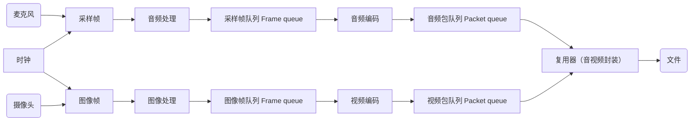
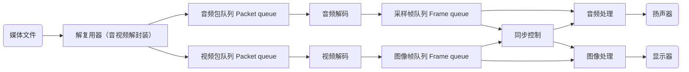
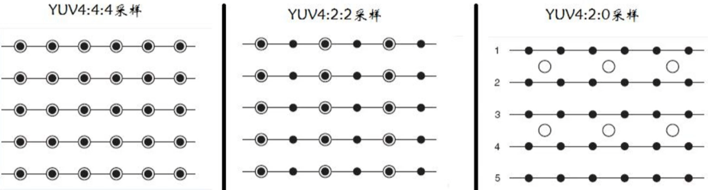

# 1. 入门概述

## 1.1 音视频采集与播放逻辑

- **采集**



- **播放**



### 音视频同步原理
- 以音频为基准
- 以视频为基准

## 1.2 基础概念
- **像素**：图片的基本单位。**pix**是**picture**的简写，加上单词**element**，就得到了**pixel**，简称**px**
- **分辨率**：像素的大小或尺寸。如：1920x1080
- **位深**：模拟世界采集时对于一个样本点用多少字节（比特）来表示。
- **帧率**：一秒钟内传输的图片数量
- **码率**：视频在单位时间内使用的数据流量。如 1Mbps
- **Stride**：指在内存中每行像素所占的空间。为了实现内存对齐每行像素在内存中所占的空间**不一定**是图像的宽度。
- **padding**：内存对齐时额外补充的数据量。处理器需要传入这些内容但是不会进行处理

### 分辨率-隔行扫描和逐行扫描
对于分辨率显示 720p 和 1080i

i和p表示扫描方式。**i**表示隔行扫描，**p**表示逐行扫描。

以1080为例：
- 1080i：1920*1080分辨率。隔行扫描的模式下高清图像是隔行显示的。每一个奇数行图像都在每一个偶数行图像后面显示出来，比如将60帧分成两部分，奇数帧只扫描奇数行，偶数帧只扫描偶数行，理论上人眼是察觉不出来画面不连续，而是由于视觉残留，能自动将两帧叠加在一起
- 1080p：1920*1080的分辨率。每一条线都同时表现在画面上，因此比隔行扫描更加平滑

### 位深
彩色图片通常都有三个通道，分别为 **红**(R)、**绿**(G)、**蓝**(B)。（如果需要透明度则还有 Alpha通道）。

通常每个通道用8bit表示，8bit能表示256种颜色。*这里的8bit就是**位深***。可以组成 256*256*256=1677万种颜色。

每个通道的位深越大，能够表示的颜色值就越大。比如现在的高端电视的 10bit色彩，即每个通道用10bit表示，由1024种颜色。1024*1024*1024=107374万种颜色。

### Stride 跨距
Stride指在内存中每行像素所占的空间。为了实现内存对齐，每行像素所占的空间不一定是图像的宽度。

Stride就是这些扩展内容的名称。Stride也被称作**Pitch**，如果图像的每一行像素末尾拥有扩展内容，Stride的值一定大于图像的宽度值

如分辨率为 638\*480 的RGB888的图像，我们在内存处理时需要以16字节对齐，则 638\*3/16=119/625 不能整除，因此不能16字节对齐。我们需要在每行尾部填充 6 个字节，就是 640\*3/16=120。此时图像的 Stride 为 1920字节
```textplain
RGB888 638*480 示例
+--------------------+-------+
|                    |=======|
|                    |=======|
|       Image        |Padding|
|                    |=======|
|                    |=======|
+--------------------+-------+
|- Image Width * 3 --|--2*3--|
|------- Stride 640*3 -------|
```

```c
// 正确写法：linesize[]代表每行的字节数量。所以每行的偏移是 linesize[]
for (int j = 0; j < frame->height; j++)
    fwrite(frame->data[0] + j * frame->linesize[0], 1, frame->width, outfile);
for (int j = 0; j < frame->height / 2; j++)
    fwrite(frame->data[1] + j * frame->linesize[1], 1, frame->width / 2, outfile);
for (int j = 0; j < frame->height / 2; j++) 
    fwrite(frame->data[2] + j * frame->linesize[2], 1, frame->width / 2, outfile);

// 错误写法：用 source.200kbps.766x322_10s.h264测试时可以看出这种方法是错误的
fwrite(frame->data[0], 1, (frame->width) * (frame->height), outfile);     // Y
fwrite(frame->data[1], 1, (frame->width) * (frame->height) / 4, outfile); // U
fwrite(frame->data[2], 1, (frame->width) * (frame->height) / 4, outfile); // V
```

## 1.3 RGB/YUV

**RGB**: 红R，绿G，蓝B 三基色

**YUV**: Y 明亮度（Luminance或Luma），也就是灰阶值。U和V表示色度（Chrominance或Chroma）

### RGB
通常图像的像素是按照RGB的顺序排列，有些图像处理要转换成其他顺序，如OpenCV经常转为BGR的排列方式

```c
enum {
    AV_PIX_FMT_RGB24,   ///< packed RGB 8:8:8, 24bpp, RGBRGB...
    AV_PIX_FMT_BGR24,   ///< packed RGB 8:8:8, 24bpp, BGRBGR...

    AV_PIX_FMT_ARGB,    ///< packed ARGB 8:8:8:8, 32bpp, ARGBARGB...
    AV_PIX_FMT_RGBA,    ///< packed RGBA 8:8:8:8, 32bpp, RGBARGBA...
    AV_PIX_FMT_ABGR,    ///< packed ABGR 8:8:8:8, 32bpp, ABGRABGR...
    AV_PIX_FMT_BGRA,    ///< packed BGRA 8:8:8:8, 32bpp, BGRABGRA...
}
```

### YUV
YUV是一个比较笼统的说法。针对具体的排列方式，可以分为多种具体的格式：

- 打包（packed）格式：将每个像素点的Y、U、V分量交叉排列并以像素点为单元连续存放在同一数组中，通常几个相邻的像素组成一个宏像素（macro-pixel）
- 平面（planar）格式L使用三个数组分开连续存放的Y、U、V三个分量。即 Y U V 分别放在各自的数组中

```textplain
YUV444 packed格式：
YUVYUVYUVYUV
YUVYUVYUVYUV
YUVYUVYUVYUV

YUV444 planar格式：
YYYYYYYYYYYY
UUUUUUUUUUUU
VVVVVVVVVVVV
```

---

**YUV表示法**

YUV采用 `A:B:C` 表示法来描述 Y,U,V 采样频率比例。

下图中黑点表示采样像素点Y分量，空心圆表示采样像素点UV分量。


---

**YUV存储格式**

对于 **YUV 4:2:0**

使用 YUV I420 存储格式：

<table>
<style>
    td {
        min-width: 40px;
        min-height: 20px;
    }
    .c1 {
        background: #DDEBF7;
    }
    .c2 {
        background: #FCE4D6;
    }
    .c3 {
        background: #FFE699;
    }
    .c4 {
        background: #8EA9DB;
    }
</style>
<tr>
<td class="c1">Y0</td><td class="c1">Y1</td><td class="c2">Y2</td><td class="c2">Y3</td>
</tr>
<tr>
<td class="c1">Y4</td><td class="c1">Y5</td><td class="c2">Y6</td><td class="c2">Y7</td>
</tr>
<tr>
<td class="c3">Y8</td><td class="c3">Y9</td><td class="c4">Y10</td><td class="c4">Y11</td>
</tr>
<tr>
<td class="c3">Y12</td><td class="c3">Y13</td><td class="c4">Y14</td><td class="c4">Y15</td>
</tr>
<tr>
<td class="c1">U0</td><td class="c2">U1</td><td class="c3">U2</td><td class="c4">U3</td>
</tr>
<tr>
<td class="c1">V0</td><td class="c2">V1</td><td class="c3">V2</td><td class="c4">V3</td>
</tr>
</table>

使用 YUV NV12 存储格式：

<table>
<style>
    td {
        min-width: 40px;
        min-height: 20px;
    }
    .c1 {
        background: #DDEBF7;
    }
    .c2 {
        background: #FCE4D6;
    }
    .c3 {
        background: #FFE699;
    }
    .c4 {
        background: #8EA9DB;
    }
</style>
<tr>
<td class="c1">Y0</td><td class="c1">Y1</td><td class="c2">Y2</td><td class="c2">Y3</td>
</tr>
<tr>
<td class="c1">Y4</td><td class="c1">Y5</td><td class="c2">Y6</td><td class="c2">Y7</td>
</tr>
<tr>
<td class="c3">Y8</td><td class="c3">Y9</td><td class="c4">Y10</td><td class="c4">Y11</td>
</tr>
<tr>
<td class="c3">Y12</td><td class="c3">Y13</td><td class="c4">Y14</td><td class="c4">Y15</td>
</tr>
<tr>
<td class="c1">U0</td><td class="c1">V0</td><td class="c2">U1</td><td class="c2">V1</td>
</tr>
<tr>
<td class="c3">U2</td><td class="c3">V2</td><td class="c4">U3</td><td class="c4">V3</td>
</tr>
</table>

---

### RGB和YUV的转换
通常情况下RGB和YUV的直接相互转换都是调用接口实现，如 Ffmpeg的swscale或libyuv等库

主要转换标准是 BT601 和 BT709。8bit位深的情况下：
- TV range是 16~235(Y), 26~240(UV)，也叫 Limited Range
- PC range是 0~255，也叫 Full Range
- RGB没有Range之分，全是 0~255
- 从YUV转到RGB如果小于0要取0，如果大于255要取255

BT601 TV Range转换公式：
```c
// YUV(256级别)可以从8位RGB直接计算
Y = 0.299 * R + 0.587 * G + 0.114 * B
U = -0.169 * R - 0.331 * G + 0.5 * B
V = 0.5 * R - 0.419 * G - 0.081 * B

// 反过来，RGB也可以直接从YUV(256级别)计算
R = Y + 1.402 * (Cr - 128)
G = Y - 0.34414 * (Cb - 128) - 0.71414 * (Cr - 128)
B = Y + 1.772 * (Cb - 128)
```

## 1.4 音频基础

### 数字声音的表示

现实中的声音都是连续波，但在计算机中只能通过采样来复原波形。人耳听到的声音频率最大为 20kHz，所以采样时通常 * 2 （采样定理，2被，CD音质 > 40kHz）

**PCM**

没有经过压缩的音频数据成为**PCM数据**

Pluse Code Modulation，脉冲编码调制。是未经压缩的音频采样数据裸流，它是由模拟信号经过采样、量化、编码转换成的标准数字音频数据

### 主要概念

- **采样频率**：每秒钟采样点的个数。常用的采样频率有：
    - 22000（22kHz）：无线广播
    - 44100（44.1kHz）：CD音质
    - 48000（48kHz）：数字电视，DVD
    - 96000（96kHz）：蓝光，高清DVD
    - 192000（192kHz）

- **采样精度**（**采样深度**）：每个采样点的大小。
    > 常用的采样深度有 8bit，16bit，24bit
    > 有浮点数表示和整数表示
    > 浮点数表示范围为 -1 ~ 1
    > 正数表示如s32：-32768 ~ 32767

- **通道数**：单声道，双声道，3声道，4声道，6声道

- **声道布局**：Channel Layout。立体声（左右声道），低音炮（2.1声道）

- **比特率**：每秒传输的比特数
    > 简介衡量声音质量的一个标准
    > 没有压缩的音频数据的比特率 = 采样频率 * 采样精度 * 通道数

- **码率**：压缩后的音频数据的比特率
    > 常见的码率
    > - 96kbps: FM质量
    > - 128~160kbps: 一般质量音频
    > - 192kbps: CD质量
    > - 256~320kbps: 高质量音频
    > 码率越大，压缩效率越低，音质越好，压缩后数据越大
    > 码率 = 音频文件大小 / 时长

#### 音频帧

**帧长**

1. 可以指每帧采样数播放的时间。mp3，48k，1152个采样点，每帧则为 24ms；aac则是每帧1024个采样点。**攒够一帧的数据才送去做编码**
2. 也可以指压缩后每帧的数据长度。

每帧持续时间(秒) = 每帧采样点数 / 采样频率（HZ）

**存储方式**

**交错模式**：数字音频信号存储的方式。数据以连续帧的方式存放。即首先记录帧1的左声道样本和右声道样本，再开始帧2的记录

> LRLRLRLR...
> 存储到本地的都是交错模式

**非交错模式**：首先记录的是一个周期内所有帧的左声道样本，再记录所有右声道样本

> LLLL...RRRR

***

# Ffmpeg

